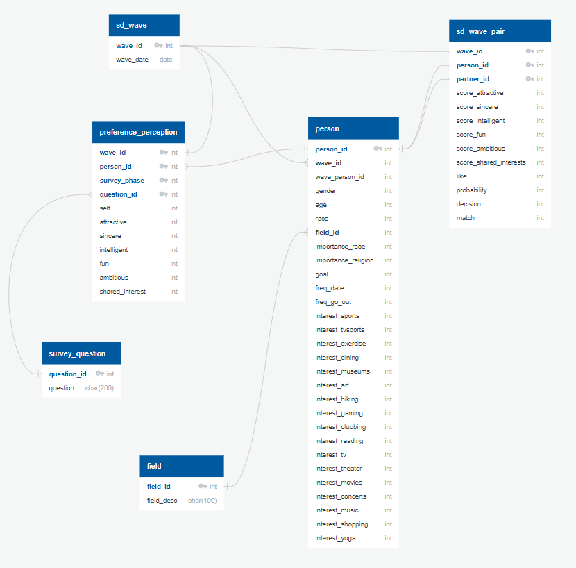

# Team Blue, Final Project 2022
University of Miami, *Data Analytics Boot camp*, Final Project

## SEGMENT 1

### Participants
- Gajardoni, Ana
- Thraher, Kristi
- Gonzalez, David

### Initial Project File Structure

### Overview 
Given the task of collaborating with a team for a final project. The project should showcase the skills we have learned in this course. 
We were asked to decide on a topic, create a repository, source a dataset, state the reason we selected our topic, provide questions we would like our analysis to answer and list the technologies we plan to use during this project lastly, provide mockups of a preliminary machine learning model and a provisional database. Assigned roles to team members. 

### Topic
SpeedDating

### Source Data: 
Source: [Columbia Business School](http://www.stat.columbia.edu/~gelman/arm/examples/speed.dating/) - 2004
* Data: Speed Dating Data.csv

* Data Description: 
The dataset contains data that was gathered from a speed dating experiments from 2002-2004.  This experiment consisted of participants of the opposite sex engaging in a 4 minute conversation with one another. Each participant then gave a ranking on their perception of the other person for several attributes including attractiveness, sincerity, intelligence, fun, ambition, ands shared interests ,demographics, dating habits, self-perception across key attributes, beliefs on what others find valuable in a mate, and lifestyle information. Dataset contains 195 attributes. 

* Reason why we selected this topic:  
Fun topic and met requirements for machine learning project.

* Question/Questions we hope to answer with this data: 

  * Can a machine learning model help in predicting and/or improving the speed dating process? 
  * Output is Match or No Match based on input data from speed dating experiement.

### Team Roles
- Gajardoni, Ana: Circle Role: Created mockup Database including the ERD and explanation of how it is integrated into database. 
- Thraher, Kristi: Triangle Role: Mockup of Machine Learning Model, including which model we choose and why along with the ReadMe file.  
- Gonzalez, David: Square Role/Triangle: Set up of Repository and Branches, Read in data and created output labels.

### Team Communication and Collaboration:
Team communicated through Slack and Zoom for scheduled meetings.  
Github is used for the project location along with source files. 

## GitHub
See repository: https://github.com/DavidGGonzalez/TeamBlue_FinalProject

GitHub contains the following requirements for segment 1:
* Main Branch
* ReadME file
* Individual Branches
Individual Branches for each teammember were created 

### Technologies:
* Application development:  
  * Visual Code
  * Jupyter Notebook
  * Flask (Web framework)

* Data Management
  * Excel
  * Pandas’ DataFrame
  * PostgreSQL

* Developmen*t Languages, formatting, web visualization
  * Python
  * JavaScript
  * HTML
  * CSS
  *	Bootstrap
  *	D3

* Data Visualization
  * Tableau

* Deployment environment
  *	Heroku

## Machine Learning Model:
### Steps required for Machine Learning Model
1.	Data Collection 
    * Load Data
      * Takes in data in from the provisional database 

The following is image showing the input data and returning labels.

Note: Data Labels: Subject to change as data gets cleaned and better classified: age, education level, income, race, religion, date frequency, survey answers.

2.  Data Preporcessing
    * Data Cleaning
      * Check for missing data or unwanted data 
      * Categorize or Gr#ouping as needed
      * Scale the data or Sampling of data if necessary. 
      * Data Encoding (transform all data to numerical data)
    
    * Feature Selection: Decide which variables will be used for our model. We will need to define our features/Independent Variables (X) and Dependent Variable (y) is       defined. 
        * X: Features that will be used to predict the y variables. 
        * Y: Target Variable (“Match (1) or Not Matched(0)”) 

    * Data Splitting: Prepare our data by splitting it into Training data and Testing data.
       * Train-Test-Split
       * Train Data (80%): This data is used to build the model that predicts outcome. 
       * Test Data (20%):  This data is applied to the trained model to make predictions after the model is trained with the training data. 

3.  Design/Define the Model: After evaluating our data set, we have decided to use the following:
    * Supervised Learning Model : We are using this model for its ability to use labled datasets to train algorithms to classify  data or predict outcomes.  
         
   	* Classification Algorithm: Logistic Regresstion is chosen to predict a dependent categorical target variable in our case match or no match. 
    		
    * Train the model
      * Fit the model with training data
          
      * Predict the outcome

4.  Evaluate the model using the test data. 
    * Use metrics such as accuracy, precision, recall, confusion matrix to show performance of our model. 

## Provisional Database 

Database mapping (from original CSV dataset):
To start, each “contender” is asked to fill a background questionnaire 
regarding various points such as age, race, interests and how important he rates a 
few matters such as same religion or same race – the list is long but simple. After 
each date, the participant is asked to rate the partner’s attributes culminating in 
one variable: whether the participant wants (or not) to have a date with the partner.
This is mapped in the Database in entities: PERSON, SD_WAVE, SD_WAVE_PERSON, 
SD_WAVE_PAIR.

Throughout the event and up to 3-4 weeks later, the participant is asked to continue
answering generic questions (always rating the same attributes listed above). Many 
of the questions proposed repeat a few times and seem more related to behavior 
than necessarily to the choices and decisions during the event. That is very 
interesting data though – especially if the answer for the same question can be 
mapped over time showing the progress. Such questions and their answers are 
mapped in the following Database entities: PREFERENCE_PERCEPTION and SURVEY_QUESTION.

### The Database

 __*ERD*__

The database consists of six entities:
-	SD_WAVE: table that holds each “round” of the experiment; the name wave was kept just for conformity with the original naming.

-	FIELD: table that holds the area of study/career of the participants; it was coded as follows:
  - 1= Law  
  - 2= Math
  - 3= Social Science, Psychologist 
  - 4= Medical Science, Pharmaceuticals, and Bio Tech 
  - 5= Engineering  
  - 6= English/Creative Writing/ Journalism 
  - 7= History/Religion/Philosophy 
  - 8= Business/Econ/Finance 
  - 9= Education, Academia 
  - 10= Biological Sciences/Chemistry/Physics
  - 11= Social Work 
  - 12= Undergrad/undecided 
  - 13=Political Science/International Affairs 
  - 14=Film
  - 15=Fine Arts/Arts Administration
  - 16=Languages
  - 17=Architecture
  - 18=Other

-	SURVEY_QUESTION: table that holds the questions made during the event. The entire experiment involved more than just matches, but many surveys that could continue up to four weeks after the date event itself. Those questions would in fact repeat in different phases and the intent was to draw a behavior picture based on their progressive responses. The questions are listed below:
o	What do you look for in the opposite sex?
o	What do you think MOST of your fellow men/women look for in the opposite sex?
o	What do you think the opposite sex looks for in a date?
o	How do you think you measure up?
o	How do you think others perceive you?
o	Distribute 100-points among the six attributes in the way that best reflects the actual importance of these attributes in your decisions.

-	PREFERENCE_PERCEPTION: table that hold the results for the questionnaires filled (questions described in SURVEY_QUESTION). In some events, the experiment used different scoring systems and some adjustments had to be made in order to get more regular data.

-	PERSON: table that holds each participant’s profile:
o	personal characteristics: age, gender, race
o	interests (scores from 1-10): sports, tv sports, exercise, dining, museums, art, hiking, gaming, clubbing, reading, tv, theater, movies, concerts, music, shopping, yoga 
o	preferences/other
	Scores 1-10: how important it is the partner is of the same race or religion
	How often does the participant go out or on dates?
•	Several times a week=1
•	Twice a week=2
•	Once a week=3
•	Twice a month=4
•	Once a month=5
•	Several times a year=6
•	Almost never=7

	What is your goal in the event?
•	Seemed like a fun night out=1
•	To meet new people=2
•	To get a date=3
•	Looking for a serious relationship=4
•	To say I did it=5
•	Other=6

-	SD_WAVE_PAIR: table that holds the results for each date: not only scores given or final match, but also the perception of each candidate on how he/she feels the partner will like her/him.

### Tables Samples

Main tables’ samples roughly obtained from the original CSV are also displayed 
below. The data might change slightly (addition/removal of fields), but the whole 
idea of how the data is stored should be the same.

__*Sample Person Data*__

__*Sample SD Wave Pair*__

__*Sample Preference Perception*__

## Dashboard 

Tools: TBD as we progress with project

Model Deployment

