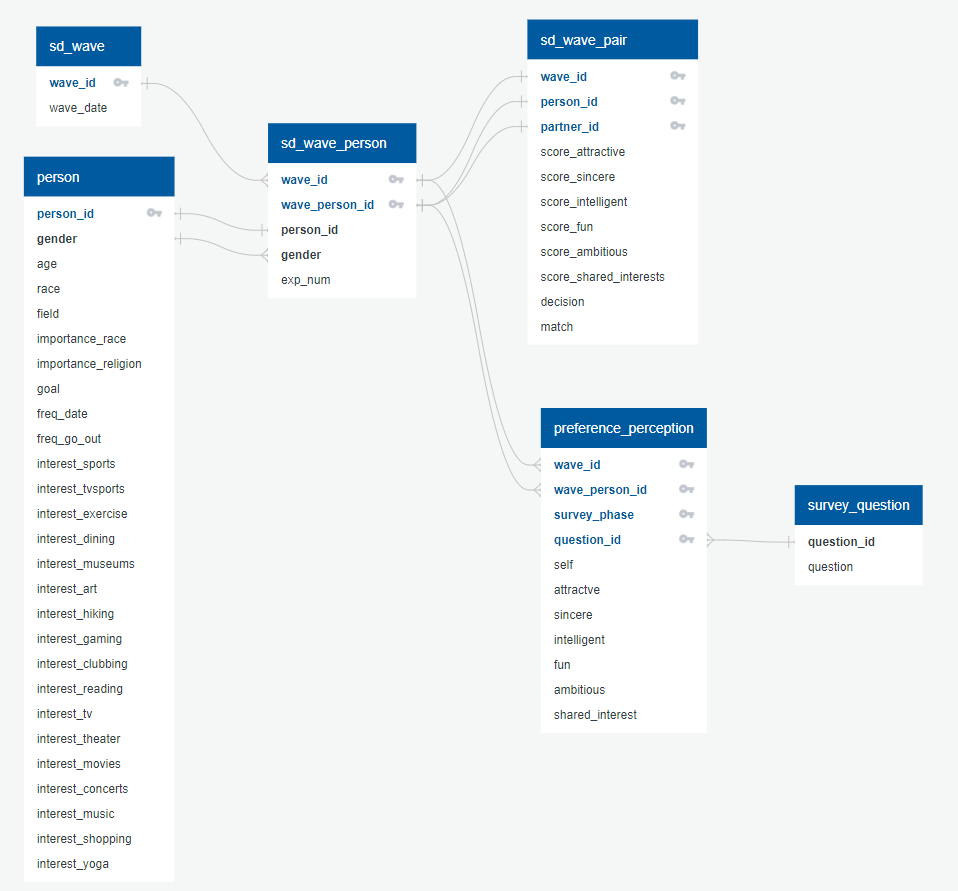

# Team Blue, Final Project 2022
University of Miami, *Data Analytics Boot camp*, Final Project

# Google Slides Presentation
https://docs.google.com/presentation/d/e/2PACX-1vQrDJtNu8tUs8CXo1efHpvvtLu_8gVtY2kp-86YUJkOw_ofrlde-w-k8xCqwpE1SxQlDK_w8nynwsA2/pub?start=false&loop=false&delayms=15000

## SEGMENT 1 and Segment 2

### Participants
- Gajardoni, Ana
- Thraher, Kristi
- Gonzalez, David

### Initial Project File Structure

### Overview 
Given the task of collaborating with a team for a final project. The project should showcase the skills we have learned in this course. 
We were asked to decide on a topic, create a repository, source a dataset, state the reason we selected our topic, provide questions we would like our analysis to answer and list the technologies we plan to use during this project lastly, provide mockups of a preliminary machine learning model and a provisional database. Assigned roles to team members. 

### Topic
SpeedDating

### Source Data: 
Source: [Columbia Business School](http://www.stat.columbia.edu/~gelman/arm/examples/speed.dating/) - 2004
* Data: Speed Dating Data.csv

* Data Description: 
The dataset contains data that was gathered from a speed dating experiments from 2002-2004.  This experiment consisted of participants of the opposite sex engaging in a 4 minute conversation with one another. Each participant then gave a ranking on their perception of the other person for several attributes including attractiveness, sincerity, intelligence, fun, ambition, ands shared interests ,demographics, dating habits, self-perception across key attributes, beliefs on what others find valuable in a mate, and lifestyle information. Dataset contains 8378 rows and 195 columns(attributes). 

* Reason why we selected this topic:  
Fun topic and met requirements for machine learning project.

* Question/Questions we hope to answer with this data: 

  * Can a machine learning model help in predicting and/or improving the speed dating process? 
  * Output is Match or No Match based on input data from speed dating experiement.

### Team Roles

#### Segment 1 
- Gajardoni, Ana: Triangle Role: Created mockup Database including the ERD and explanation of how it is integrated into database. 
- Thraher, Kristi: Square Role: Mockup of Machine Learning Model, including which model we choose and why along with the ReadMe file. 
- Gonzalez, David: Square Role/Triangle: Set up of Repository and Branches, Read in data and created output labels.

#### Segment 2
- Gajardoni, Ana: Circle Role: Transform the mockup database into a full database that integrates with your work. 
- Thraher, Kristi: Square Role: Refine the machine learning model you'll be using (train and test).  
- Gonzalez, David: Circle/X Role: Continue with analysis and create visuals to acoompany the data story. Begin Outline of dashboard.

### Team Communication and Collaboration:
Team communicated through Slack and Zoom for scheduled meetings.  
Github is used for the project location along with source files. 

## GitHub
See repository: https://github.com/DavidGGonzalez/TeamBlue_FinalProject

GitHub contains the following requirements for segment 1:
* Main Branch
* ReadME file
* Individual Branches
Individual Branches for each teammember were created 

Segment 1

Segment 2 

### Technologies:
* Application development:  
  * Visual Code
  * Jupyter Notebook
  * Flask (Web framework)

* Data Management3372defd4526.png)

  * Excel
  * Pandas’ DataFrame
  * PostgreSQL

* Developmen*t Languages, formatting, web visualization
  * Python
  * JavaScript
  * HTML
  * CSS
  *	Bootstrap
  *	D3

* Data Visualization
  * Tableau

* Deployment environment
  *	Heroku

## Machine Learning Model:
### Steps required for Machine Learning Model
1.	Data Collection 
    * Load Data
      * Takes in data in from the provisional database 

The following is image showing the input data and returning labels.

Note: Data Labels: Subject to change as data gets cleaned and better classified: age, education level, income, race, religion, date frequency, survey answers.

2.  Data Preprocessing
    We simplified our dataset by including only the relevant features for our analysis. 
    * Data Cleaning
    * Simplify the DataSet: The data was gathered from speed dating events from 2002-2004. During the date participants would have 4 minute "dates" with another participant of the opposite gender. At the end of each 4 minute "date" each participant had a score card and were asked to rate their date on specifics. The dataset also includes some demographic info, such as gender, age, race, career, income, goal, what others find valuable in a mate, and lifestyle info. This dataset is large with 8378 rows and 195 columns.
We decided we did not need all of this information so decided to simplify our dataset. The dataset is now 8378 rows and 20 columns. 

* Data Exploration/Visualizations 
* For Fun we decided to see the distribution of matches for age, race, gender with matches and also how many matches were made. 

#### Data Cleaning
* Check for null values 
 

We saw several had missing values but we see the income attribute has 4099 missing datapoints, which is half of the entire data so will drop the income column. By dropping this column it won't affect the dataset's integrity. We also see that there are several missing values from all columns but gender, and match so we may have to some imputation or drop null columns depending on percentage of missing values and how it would affect our data. We saw several missing values did exist so we will handle those by removing them completly if it has more than 50-75% of missing values. This method is advised only when there are enough samples in the data set. Lets first view to see if less than .50

We dropped all null values because it was way less than 50% of our dataset.

* Check for datatypes: All datatypes are numberical so no coversion needed to be done

* Check Correlation of features: Pandas' DataFrame corr () Method Correlation to measure the strength of the linear relationship between two variables.This method computes the pairwise correlation of columns, excluding NA/null values. 

   
The correlation coefficients along the diagonal of the table are all equal to 1 because each variable is perfectly correlated with itself. The others are close but not past .75. We also see that match has high correlation to fun, fun_o, attr, attr_0 and like, like_0.  We also see that field_cd, race, age don't have much if any correlation to the other attributes and gender has some with attritiveness, overall like and match of course.  
 
  *  Check for datatypes:After checking datatypes we saw this to be unnecessary because they were all numerical, no scaling, imputation 						or encoding needed. 
				

We saw that no scaling or encoding needed and dataset shape dropped to 5905, 19. 

3. Feature Selection: Decide which variables will be used for our model. We will need to define our features/Independent Variables 	(X) and Dependent Variable (y) is defined. 
        * X: Features that will be used to predict the y variables. 
        * Y: Target Variable (“Match (1) or Not Matched(0)”) 
    
    * Data Splitting: we will use the Scikit-Learn's train_test_split function. Note: A problem that can occur if data isn't split correctly is underfitting and overfitting of your model. 
       * Train Data (80%): This data is used to build the model that predicts outcome. 
       * Test Data (20%):  This data is applied to the trained model to make predictions after the model is trained with the training data. This is how we make the algorithm learn the relationship between our predictors(x) and outcome(y) so that it can make a prediction in the future on new data. 

4.  Modeling/Design/Define the Model: Once the Data is defined, and it is split into training and testing data. It is time to design the model. We chose a Supervised Learning Model because our data is labeled data and are using this model for its ability to use labled datasets to train algorithms to classify  data or predict outcomes.  We also know we will use a Classification Model because we know Classification models belong to the class of conditional models, that is, probabilistic models that specify the conditional probability distributions of the output data given the input data.
We chose to use two different classification algorithms to decide which one performs best then we will determine  which model had better performance. We will start with a Logistic Regression model, then try the ensemble classifier Balanced Random Forest. 

-	Set up our model by importing and defining which algorithm we will be using.
	* Train the model: trained the model on training set of data. 
	* Fit the model with testing data.

#### Logistic Regresstion: this algorithm  was chosen because the dependent variable is known to be simple and straight forward.  It is a predictive analysis used to describe the data and explain the realationship of the one dependent variable and  independent variables. It does have both benefits and limitations here are the following:
-	Benefits: Simple and easy to implement with effective results in some cases. 
-	Limitations to this algorithm is in those cases where the data isn't so straightforward and because it is a statistical evaluation model the attempts to predict an exact probabilistic outcomes based on independent features it may not measure up. Will there be a match or not based on the independent variables(X). That is the question. Not sure until you train and test it and compare to other models. 
	
-	Train the model
	For Logistic Regression we import LogisticRegression from the sklearn.linear model library and set up our model with the training data. 
-	Fit the model with training data
	

##### Ensemble Classiier Balanced Random Forest: we used Ensemble Classifier because it can be used to solve for regression or classification problems and it is known to creates a machine learning model that is capable of performing better than individually by using multiple models together. This will help improve the accuracy and robustness as well as decrecrease the variance of the model and increase the overall perfomance of the model. For  In our case it is a classification problem. Will there be a match or not. Some more benefits and limitations to this algorithm is listed as the following: 
	
-	Benefits: Works well with non-linear data. It is known to have better accuracy than other algorithms. It is flexable like logistic regression and can work on both regression and classification problems. It also makes it easy to view the importance of the input features. I have included a picture of that. 
	

	
-	Limitations: It can be slower to run and test and make it real time testing ineffective. 
-	Train the model
	Balanced Random Forest we imported BalancedRandomForestClassifier form imblearn.ensemble.
-	Fit the model with training data
	
	
5.  Evaluate the model using the test data. 
    * Use metrics such as accuracy, precision, recall, confusion matrix to show performance of our model. 
    * Predict the outcome with different metrics such as accuracy score(a measurement of how closely you predicted the right outcome), precision( represents the ratio of true positive to the sum of true positive and false positive.) and f1 score(F1-score, is a measure of a model’s accuracy on a dataset.)
    
	##### Evaluate the Logistic Regression Model
	
	
	
	* We see from accuracy score we had 0.6431587123608596 and confusion matrix shows 1160 True Positives, 87 True Negatives, 176 False Positives, and 54 False Negatives. The Classification Report showed an F1 score of .82 and Precision score of .82.    
	

	##### Evaluate the BalancedRandomForest Model
	
	
	
	* We see from accuracy score we had 0.7650979384995082 and confusion matrix shows 1160 True Positives, 87 True Negatives, 176 False Positives, and 54 False Negatives. The Classification Report showed an F1 score of .82 and Precision score of .82.

#### Conclusion and Summary 
The Main Goal of this project was to predict if there would be a match or not based on the input data provided. After some Data preprocessing and using visualizations such as the correlation matrix and others we were able to define a dataset by splitting it into training and testing data and ran two supervised machine learning algorithms with the data. In the end we saw that Balanced Random Forest Classifer algorithm showed a higher probability of predicting correctly than the Logistic Regression algorithm. 

## Provisional Database 

Database mapping (from original CSV dataset):
To start, each “contender” is asked to fill a background questionnaire 
regarding various points such as age, race, interests and how important he rates a 
few matters such as same religion or same race – the list long but simple. After 
each date, the participant is asked to rate the partner’s attributes culminating in 
one variable: whether the participant wants (or not) to have a date with the partner.
This is mapped in the Database in entities: PERSON, SD_WAVE, SD_WAVE_PERSON, 
SD_WAVE_PAIR.

Throughout the event and up to 3-4 weeks later, the participant is asked to continue
answering generic questions (always rating the same attributes listed above). Many 
of the questions proposed repeat a few times and seem more related to behavior 
than necessarily to the choices and decisions during the event. That is very 
interesting data though – especially if the answer for the same question can be 
mapped over time showing the progress. Such questions and their answers are 
mapped in the following Database entities: PREFERENCE_PERCEPTION and 

SURVEY_QUESTION.
A initial ERD proposal is shown below – this might change slightly according to the 
data we find in the dataset.

 __*ERD*__

Main tables’ samples roughly obtained from the original CSV are also displayed 
below. The data might change slightly (addition/removal of fields), but the whole 
idea of how the data is stored should be the same.

__*Person Data*__

__*Sample SD WAVE Person*__

__*Sample SD Wave Pair*__

__*Sample Preference Perception*__

## Dashboard 

Tools: TBD as we progress with project

Model Deployment
